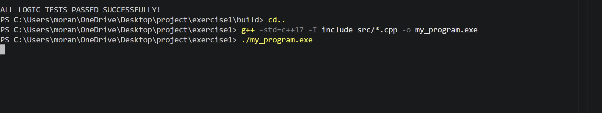
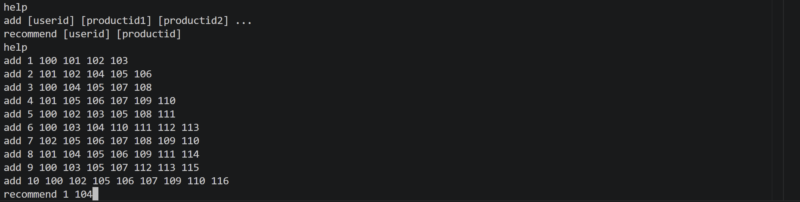

## Overview
This project is a C++ Command-Line Interface (CLI) application that functions as a product recommendation system. The system allows users to associate viewed products with specific user IDs and generates recommendations based on the viewing history of other users with similar tastes.

A core design feature of this application is its strict adherence to **silent execution rules**: the program runs continuously, and any invalid commands or incorrect inputs are completely ignored without printing any error messages.

## Architecture & Development Methodology
The system was designed and implemented with the following principles:
* **SOLID Principles & Loose Coupling:** The codebase is structured to allow easy future expansions, such as changing the data storage mechanism or adding new input/output streams.
* **Separation of Concerns:** Code is strictly separated into header (`.h`) and implementation (`.cpp`) files.
* **Test-Driven Development (TDD):** The implementation and task planning were guided by TDD methodology.
* **Agile Workflow:** Development was managed using Jira, utilizing Epics, User Stories, and sprint planning with feature branches and pull requests.

## Project Structure
The project directory is organized as follows:
* `include/` - Contains all the header (`.h`) files for class declarations.
* `src/` - Contains all the source code (`.cpp`) files.
* `tests/` - Contains the unit and integration tests verifying the application logic.
* `data/` - Contains the persistent data files automatically saved and loaded by the application.
* `Dockerfile` - Instructions for running the application inside a Docker container.
* `README.md` - Project documentation.

## How To Run The Project:
### Step 1: Create the Shared Docker Network (Required Once)
``bash
docker network create my-network
### Step 2: Build and Run the Server
## Server Docker
build: docker build -f Dockerfile.server -t cpp-server .
run: docker run -p 8000:8000 -v "$(pwd)/data:/app/data" cpp-server
### Step 3: Build and Run the Client
## Client Docker
build: docker build -f Dockerfile.client -t python-client .
run: docker run -it python-client host.docker.internal 8000

## How To Run The Unit Tests:
## Tests Docker
build: docker build -f Dockerfile.tests -t unit-tests .
run: docker run -it test_env

##  Building and Running (Local)

To compile the project manually from the root directory, use the following `g++` command:

```bash
g++ -std=c++17 -I include src/*.cpp -o my_program.exe
./my_program.exe

To run the compiled application:

Bash
./my_program.exe
Running with Docker
The project includes a Dockerfile for containerized execution.

Build the image:

Bash
docker build -t ex1-recommender .
Run the container:
Bash
docker run -it ex1-recommender
Commands & Usage
The application supports the following commands. Commands can be executed in any order and as many times as needed.

1. Help Command
Prints the list of available commands.

Plaintext
> help
add [userid] [productid 1] [productid2] ...
recommend [userid] [productid]
help
(Note: Each command in the output is printed on a single line ending with a newline character.)
2. Add Command
Associates a list of products with a user. The command requires at least one product ID but can accept multiple. Fields can be separated by one or multiple spaces.

Plaintext
> add 1 100 101 102
Output: None (Silent).

Persistence: Data is automatically saved to the data/ directory. If the program restarts, it reloads this data to provide identical recommendations.

3. Recommend Command
Provides up to 10 product recommendations for a specific user based on a target product. Recommendations are calculated using a similarity-weight algorithm matching users with common viewing histories.


Plaintext
> recommend 1 104
Authors
Moran

Noam

Yarin
